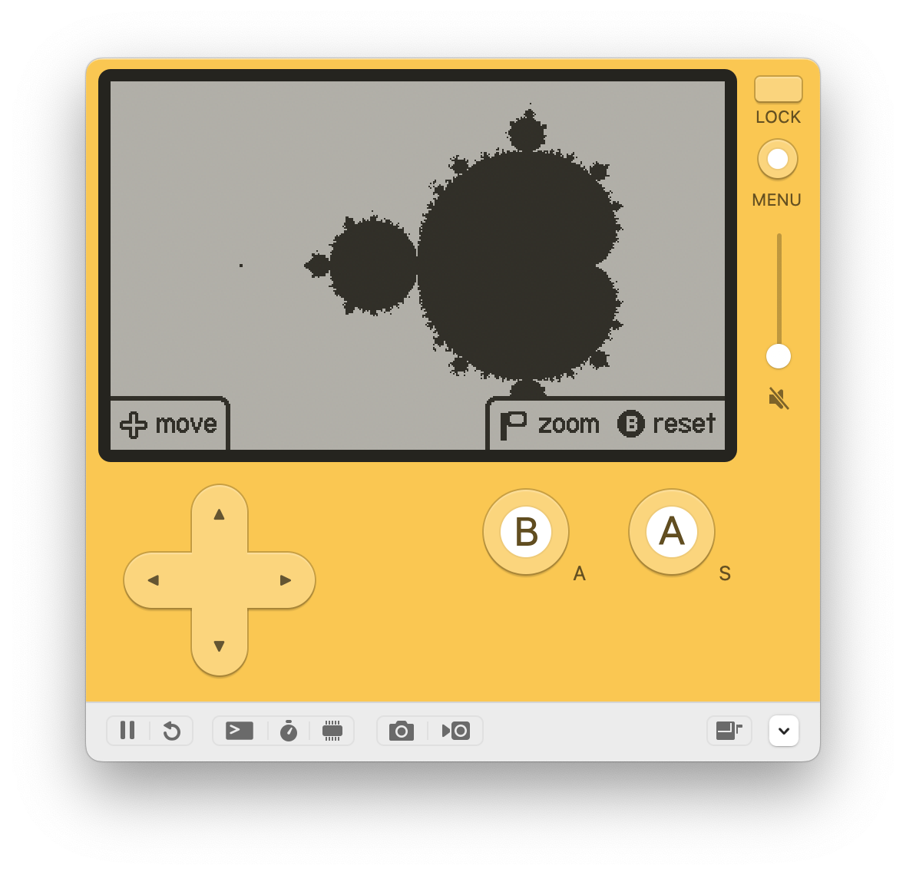

# Mandelbrot Playdate


## Build for the Simulator

```bash
mkdir build
cd build
cmake -DCMAKE_BUILD_TYPE=Release ..
make
```

This will create a mandelbrot.pdx executable which on macOS you can execute in 
the Simulator with `open mandelbrot.pdx`.

## Build for the Playdate

```bash
mkdir build
cd build
cmake -DCMAKE_TOOLCHAIN_FILE=<path to SDK>/C_API/buildsupport/arm.cmake -DCMAKE_BUILD_TYPE=Release ..
make
```

This will create a mandelbrot.pdx executable which on macOS you can execute in 
the Simulator with `open mandelbrot.pdx`.

In the Simulator go to: Device -> Upload to Device.

Note: The simulator might not run the game or display a different build as this 
binary is not compatible with it.

## Resources

- [http://cowlark.com/2018-05-26-bogomandel/index.html](Rapidly rendering fractals on stupidly unsuitable machines)
- [https://en.wikibooks.org/wiki/Fractals/Iterations_in_the_complex_plane/demm#Interior_distance_estimation](Fractals/Iterations in the complex plane/demm)
- [https://mathr.co.uk/web/mandelbrot.html](The Mandelbrot Set - mathr)